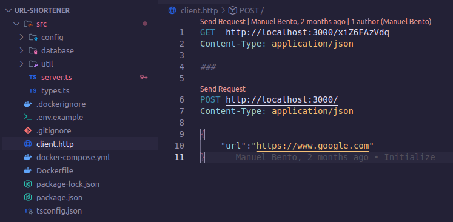

<h1 align="center">
  📸📝 URL Shortner
</h1>

An URL shortener is a website that reduces the length of your URL (Uniform Resource Locator). The idea is to minimize the web page address into something that's easier to remember and track.

<h4 align="center"><a href="https://url-shortener-dx5g.onrender.com/">Clique para visitar o projeto</a></h4>

---

## 💼 Tecnologias utilizadas

Para o desenvolvimento deste site utilizei as seguintes tecnologias:
- Node.js
- Fastify
- PostgreSQL
- Prisma
- Docker
- Docker Compose
---

<h2>👨‍🚀 Autor</h2>

<table>
  <tr>
    <td>
      <a href="https://github.com/manuelbento19">
         
        
          <b>Manuel Bento</b>
        
      </a>
    </td>
  </tr>
</table>